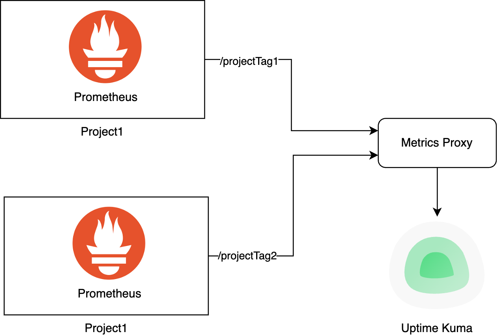
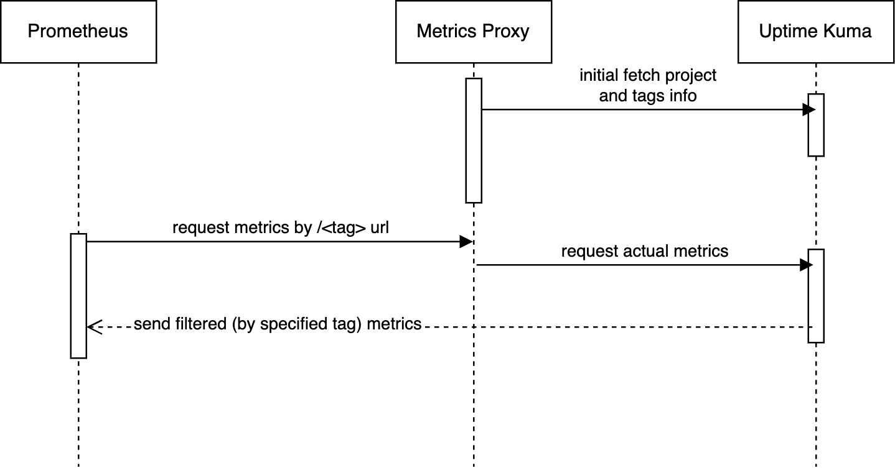

# Uptime Kuma metrics proxy

* [1 How it works](#how-it-works)
* [2 Add to your uptime-kuma](#add-to-your-uptime-kuma)
* [3 Example setup](#example-setup)
* [4 Example setup](#faq)

Prometheus metrics filter proxy for uptime kuma

This project is a simple proxy for https://github.com/louislam/uptime-kuma service prometheus metrics

If you are using single uptime-kuma instance for multiple projects, but want to integrate it with different prometheus
and grafana dashboards, this project is for you.

## How it works

- parses all services and specified tags from uptime-kuma (and updates it, as specified in env
  var `METRICS_PROXY_TAGS_TTL_SECONDS`)
    - there is only 1 vanilla way to get it, via socket.io connection, so we using it
- proxies all requests on uptime-kuma instance
    - if no tags specified, we acting like a direct proxy to kuma
    - if there any tag specified in url, like `/my-tag`, it will keeps only metrics, for services, labeled with
      specified tag



By that, we can add tags onto target services in uptime-kuma and configure different prometheus collectors to specific
services.



## Add to your uptime-kuma

To use it, you need follow this steps:

- create .env file with your setup
- run proxy (from binary or using docker)
- setup proxy behind reverse proxy
- (?) configure your prometheus config

## Example setup

Docker compose config to startup all services

```yaml
version: '3'
services:
  # just nginx with built in let's encrypt bot
  domain-nginx:
    restart: always
    image: staticfloat/nginx-certbot
    ports:
      - 80:80/tcp
      - 443:443/tcp

    environment:
      - CERTBOT_EMAIL=my-example-email@gmail.com
    volumes:
      - ./conf.d:/etc/nginx/user.conf.d:ro
      - letsencrypt:/etc/letsencrypt


    networks:
      - local

  uptime_kuma:
    restart: always
    image: louislam/uptime-kuma:1

    volumes:
      - /var/uptime-kuma:/app/data

    networks:
      - local

  metrics_proxy:
    restart: always
    image: 'sensiarion/uptime-kuma-metrics-proxy:latest'
    expose:
      - 3002

    platform: linux/amd64
    # see .env.example for rest settings
    env_file:
      - .env
    environment:
      - METRICS_PROXY_HOST=0.0.0.0
      - METRICS_PROXY_PORT=3002
      # since we want to drop in replace original metrics, we need to internal access (otherwise we'll stuck in the loop)
      - METRICS_PROXY_KUMA_URL=http://uptime_kuma:3001/metrics
      - METRICS_PROXY_KUMA_LOGIN=<kuma account login>
      - METRICS_PROXY_KUMA_PASSWORD=<kuma account password>

    networks:
      - local

volumes:
  letsencrypt:

networks:
  local:
```

Nginx config (`./conf.d/server.conf`)

```
server {
    listen 443 ssl;
    # listen [::]:443 ssl http2;
    server_name         <my_example_domain.com>;
    ssl_certificate     /etc/letsencrypt/live/<my_example_domain.com>/fullchain.pem;
    ssl_certificate_key /etc/letsencrypt/live/<my_example_domain.com>/privkey.pem;
    
    # will rewrite default kuma /metrics url onto our version
    # by default (with no tags passed), it will act as original endpoint
    location /metrics {
        rewrite ^/metrics/(.*)$ /$1 break;
        proxy_pass http://metrics_proxy:3002/;
        proxy_set_header Host $host;
        proxy_set_header X-Forwarded-For $proxy_add_x_forwarded_for;
        proxy_set_header X-Real-IP $remote_addr;   
        proxy_http_version 1.1;
        proxy_set_header   Upgrade $http_upgrade;
        proxy_set_header   Connection "upgrade";     
    }

    location / {
        proxy_pass http://uptime_kuma:3001;
        proxy_set_header Host $host;
        proxy_set_header X-Forwarded-For $proxy_add_x_forwarded_for;
        proxy_set_header X-Real-IP $remote_addr;   
        proxy_http_version 1.1;
        proxy_set_header   Upgrade $http_upgrade;
        proxy_set_header   Connection "upgrade";     
    }

}
```

And update prometheus config

```yaml
# see original tutorial for more https://github.com/louislam/uptime-kuma/wiki/Prometheus-Integration
- job_name: 'uptime'
  scrape_interval: 30s
  scheme: https
  # metrics will be filtered by specified tag   
  metrics_path: '/metrics/<my-tag>'
  static_configs:
    - targets: [ '<my_example_domain.com>' ]
  basic_auth: # Only needed if authentication is enabled (default) 
    password: <your kuma token>

```

That's it! In this configuration we:

- replacing original uptime-kuma /metrics url with proxy version
- can request full list of metrics by /metrics url
- can request metrics by kuma tag, by /metrics/my-tag url

## FAQ

> why does this service require my uptime kuma login and password

- since uptime kuma have no http api, we need to fetch project tags info via websocket. The only way to do it - use
  login and password.

## TODO list

- [x] tocdown
- [ ] build binary in github actions
- [ ] tracing setup (currently logs are really poor)
- [x] release docker image
- [x] fast start tutorial (docker-compose)
- [x] add compose + nginx config example (remove usage-example file)